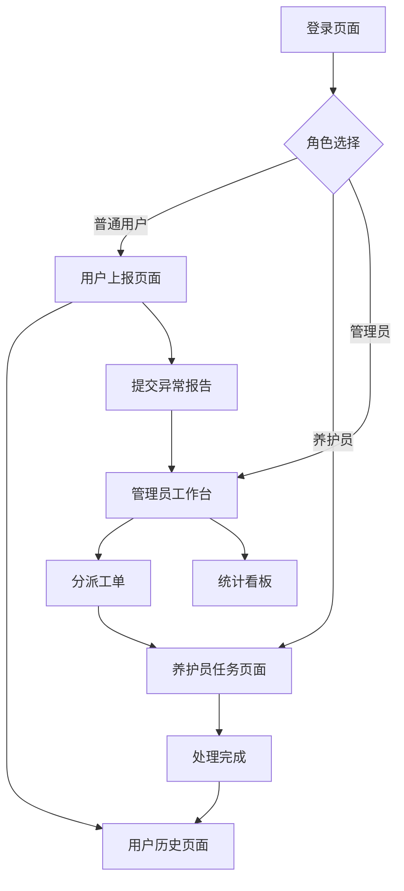

## 1. 产品概述
校园植物异常处理系统旨在为学校后勤部门提供高效的植物健康问题处理方案。系统通过用户友好的界面让师生快速上报植物异常，管理员智能分派工单，养护员及时处理，实现植物健康管理的数字化和智能化。

目标用户包括：普通师生（上报异常）、养护员（处理工单）、管理员（分派和管理）。系统价值在于提升植物异常处理效率，保障校园绿化质量。

## 2. 核心功能

### 2.1 用户角色
| 角色 | 注册方式 | 核心权限 |
|------|----------|----------|
| 普通用户 | 邮箱注册 | 提交异常报告、查看个人历史记录 |
| 养护员 | 管理员分配账号 | 查看处理被分派的工单、上传处理结果 |
| 管理员 | 系统初始化账号 | 全权限：工单分派、用户管理、数据统计、系统配置 |

### 2.2 功能模块
系统包含以下核心页面：
1. **登录页面**：用户身份验证、角色选择
2. **用户上报页面**：植物异常照片上传、问题类型选择、描述填写、智能识别结果展示
3. **用户历史页面**：个人提交记录查看、处理状态跟踪
4. **管理员工作台**：待处理工单列表、分派功能、筛选排序、统计看板
5. **养护员任务页面**：被分派工单列表、处理详情、结果提交
6. **系统管理页面**：用户管理、权限配置、审计日志查看

### 2.3 页面详情
| 页面名称 | 模块名称 | 功能描述 |
|----------|----------|----------|
| 登录页面 | 身份验证 | 输入邮箱密码登录、选择用户角色、记住登录状态 |
| 用户上报页面 | 照片上传 | 支持JPG/PNG格式、单张5MB限制、实时预览、拖拽上传 |
| 用户上报页面 | 异常类型选择 | 预设病虫害/缺水/营养不良等选项、支持多选 |
| 用户上报页面 | 描述填写 | 最少20字要求、实时字数统计、富文本编辑器 |
| 用户上报页面 | 智能识别 | 调用Dify API分析照片、返回3-5个解决方案、30秒内响应 |
| 管理员工作台 | 工单列表 | 展示所有待处理工单、支持紧急程度/时间/区域筛选 |
| 管理员工作台 | 分派功能 | 选择养护员、设置优先级、添加备注说明 |
| 管理员工作台 | 实时同步 | WebSocket连接、状态变更1秒内推送、进度可视化 |
| 养护员任务页面 | 任务列表 | 显示被分派工单、按优先级排序、48小时超时提醒 |
| 养护员任务页面 | 处理提交 | 上传对比照片、填写处理方法、材料使用、效果评估 |
| 系统管理页面 | 权限管理 | RBAC角色控制、用户组管理、权限分配 |
| 系统管理页面 | 审计日志 | 记录用户操作、保留180天、支持时间范围检索 |

## 3. 核心流程

### 普通用户流程
用户登录系统 → 进入上报页面 → 上传植物异常照片 → 系统自动识别并推荐解决方案 → 用户确认或修改异常类型 → 填写详细描述 → 提交异常报告 → 查看个人历史记录跟踪处理进度

### 管理员流程
管理员登录 → 查看待处理工单列表 → 根据紧急程度和区域筛选 → 选择合适的养护员进行分派 → 实时监控工单处理进度 → 处理超时提醒 → 查看统计数据和报表

### 养护员流程
养护员登录 → 查看被分派的任务列表 → 选择待处理工单 → 现场处理植物异常 → 上传处理前后对比照片 → 填写详细的处理报告 → 提交完成状态 → 系统自动记录处理时长

## 4. 用户界面设计

### 4.1 设计风格
- **主色调**：绿色系（#52c41a）体现植物主题，辅以橙色（#fa8c16）表示警告
- **按钮样式**：圆角矩形，主要操作使用主色调，危险操作使用红色
- **字体**：中文使用思源黑体，英文使用Roboto，正文字号14px，标题16-20px
- **布局风格**：卡片式布局，左侧导航+右侧内容区域，响应式网格系统
- **图标风格**：使用Ant Design图标库，线性风格，统一尺寸16px/20px

### 4.2 页面设计概览
| 页面名称 | 模块名称 | UI元素 |
|----------|----------|--------|
| 登录页面 | 登录表单 | 居中卡片布局、绿色渐变背景、圆角输入框、大号登录按钮 |
| 用户上报页面 | 上传区域 | 虚线边框拖拽区域、上传进度条、缩略图预览网格 |
| 用户上报页面 | 识别结果 | 卡片式解决方案展示、置信度百分比、绿色成功图标 |
| 管理员工作台 | 工单卡片 | 状态标签彩色标识、优先级星标、时间线展示 |
| 养护员任务页面 | 任务列表 | 手机端优先、大按钮易于点击、滑动操作菜单 |
| 统计看板 | 数据图表 | 柱状图/饼图、趋势曲线、关键指标卡片 |

### 4.3 响应式设计
系统采用桌面端优先设计，管理员和用户界面主要面向桌面使用。养护员界面采用移动端优先设计，确保在手机上的良好体验。所有页面都支持响应式布局，适配不同屏幕尺寸。

### 4.4 移动端优化
养护员界面特别优化触摸交互：增大按钮点击区域（最小44px）、支持滑动操作、使用底部导航栏、适配手机相机拍照上传功能。