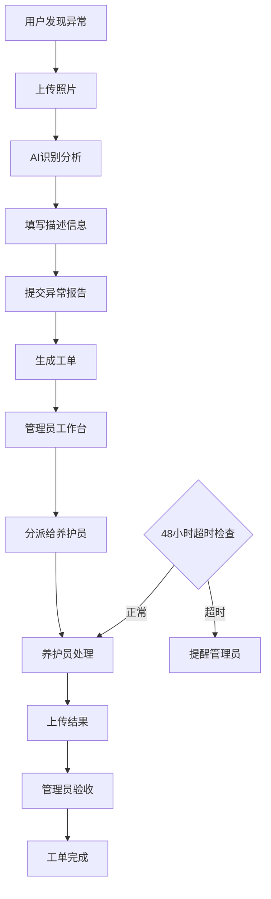

## 1. 产品概述
校园植物异常处理系统是一个专为学校环境设计的智能化植物养护管理平台。通过AI图像识别技术和实时工单系统，帮助学校快速发现、分派和处理植物异常问题，提升校园绿化管理效率。

系统主要解决传统植物养护中异常发现不及时、处理流程不透明、责任分工不明确等问题，为师生、养护员和管理员提供一站式植物健康管理解决方案。

## 2. 核心功能

### 2.1 用户角色
| 角色 | 注册方式 | 核心权限 |
|------|----------|----------|
| 普通用户 | 学号/工号注册 | 提交异常报告、查看个人历史记录、接收处理进度通知 |
| 养护员 | 管理员分配账号 | 查看分派工单、上传处理结果、更新工单状态 |
| 管理员 | 系统初始化账号 | 工单分派、用户管理、数据统计、系统配置 |

### 2.2 功能模块
系统包含以下核心页面：
1. **异常上报页面**：照片上传、类型选择、描述填写、AI识别结果展示
2. **管理员工作台**：异常工单列表、筛选排序、分派操作、进度看板
3. **养护员移动端**：任务列表、工单详情、处理结果提交
4. **个人中心**：历史记录、个人信息、通知设置

### 2.3 页面详情
| 页面名称 | 模块名称 | 功能描述 |
|----------|----------|----------|
| 异常上报页面 | 照片上传模块 | 支持JPG/PNG格式上传，单张不超过5MB，显示上传进度和预览 |
| 异常上报页面 | 异常类型选择 | 提供病虫害、缺水、营养不良等预设选项，支持多选 |
| 异常上报页面 | 描述填写区域 | 必填文本输入，最少20字，实时字数统计和验证提示 |
| 异常上报页面 | AI识别展示 | 显示识别结果置信度，推荐3-5个解决方案，支持重新识别 |
| 管理员工作台 | 工单列表 | 展示所有异常工单，包含状态、紧急程度、上报时间等关键信息 |
| 管理员工作台 | 筛选排序 | 支持按紧急程度、时间范围、植物区域等维度筛选，可组合排序 |
| 管理员工作台 | 分派弹窗 | 选择养护员、设置优先级、添加备注说明，一键批量分派 |
| 管理员工作台 | 进度看板 | 可视化展示各阶段工单数量，预计完成时间，超时预警提醒 |
| 养护员移动端 | 任务列表 | 显示分派给我的工单，按紧急程度排序，支持快速筛选 |
| 养护员移动端 | 工单详情 | 查看异常描述、位置信息、照片对比，确认接收任务 |
| 养护员移动端 | 处理提交 | 上传处理后照片，填写处理方法、使用材料、效果评估 |
| 个人中心 | 历史记录 | 查看自己提交的所有异常报告及处理状态，支持导出 |
| 个人中心 | 通知设置 | 配置接收通知方式，设置免打扰时间段，查看通知历史 |

## 3. 核心流程

### 3.1 异常上报流程
用户发现植物异常 → 拍照上传 → 选择异常类型 → 填写详细描述 → AI智能识别 → 系统推荐解决方案 → 提交报告 → 生成工单

### 3.2 工单处理流程
管理员接收新工单 → 评估紧急程度 → 分派给养护员 → 养护员接收通知 → 现场确认处理 → 上传处理结果 → 管理员验收 → 工单完成

### 3.3 超时提醒流程
工单分派后启动48小时计时 → 超时前12小时首次提醒 → 超时后立即二次提醒 → 通知管理员重新分派 → 记录超时原因

## 4. 用户界面设计

### 4.1 设计规范
- **主色调**：绿色系（#22c55e）代表生态环保，辅以橙色（#f97316）作为强调色
- **按钮样式**：圆角矩形，主要操作使用填充样式，次要操作使用边框样式
- **字体选择**：主标题使用18px加粗，正文使用14px常规，提示文字使用12px
- **布局风格**：卡片式布局，阴影效果，响应式网格系统
- **图标风格**：使用简洁的线性图标，与植物主题相关的自然元素

### 4.2 页面设计详述
| 页面名称 | 模块名称 | UI元素设计 |
|----------|----------|------------|
| 异常上报页面 | 照片上传区 | 拖拽上传区域，虚线边框，上传图标居中，支持点击选择 |
| 异常上报页面 | 类型选择器 | 宫格布局的选项卡片，选中状态使用绿色边框和背景色 |
| 异常上报页面 | 描述输入框 | 带字数的文本域，底部显示实时字数，边框聚焦变绿色 |
| 异常上报页面 | AI结果展示 | 卡片式结果展示，置信度使用进度条可视化，解决方案列表 |
| 管理员工作台 | 工单表格 | 斑马纹表格，状态标签使用不同颜色区分，操作按钮组合 |
| 管理员工作台 | 筛选面板 | 折叠式筛选面板，下拉选择器，日期范围选择器 |
| 管理员工作台 | 分派弹窗 | 模态对话框，养护员下拉列表，优先级滑块选择器 |
| 养护员移动端 | 任务卡片 | 大卡片布局，紧急程度使用红色角标，滑动操作手势 |
| 养护员移动端 | 照片对比 | 左右滑动对比，支持放大查看细节，添加标注功能 |

### 4.3 响应式设计
- **桌面端优先**：默认设计为桌面端使用，充分利用大屏幕空间
- **移动端适配**：针对养护员使用场景，重点优化移动端体验
- **触摸优化**：按钮大小不小于44px，支持手势操作，适配各种屏幕尺寸
- **断点设置**：768px为平板断点，480px为手机断点，内容自动重排

### 4.4 实时交互
- **WebSocket连接**：建立持久连接，确保状态变更实时推送
- **加载动画**：上传照片时使用进度条，AI识别时使用旋转动画
- **过渡效果**：页面切换使用淡入淡出，卡片hover使用微动效
- **通知提示**：使用toast提示替代alert，支持自动消失和手动关闭