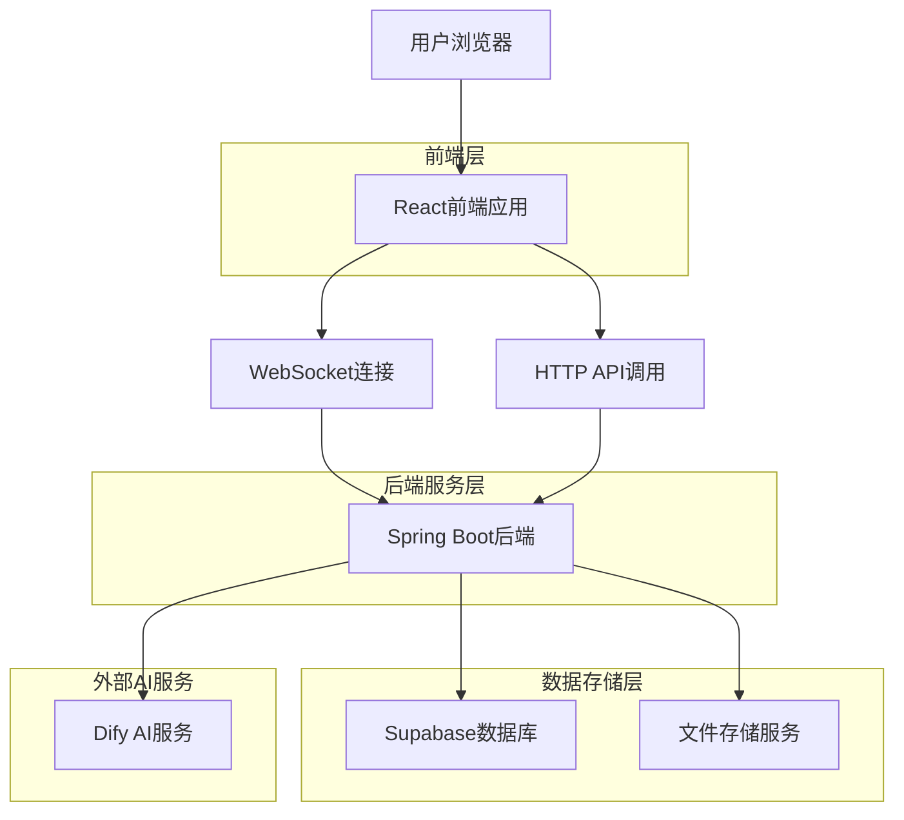
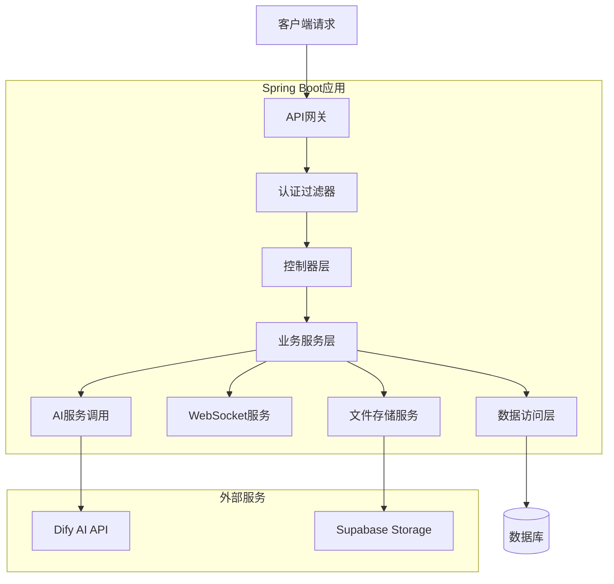
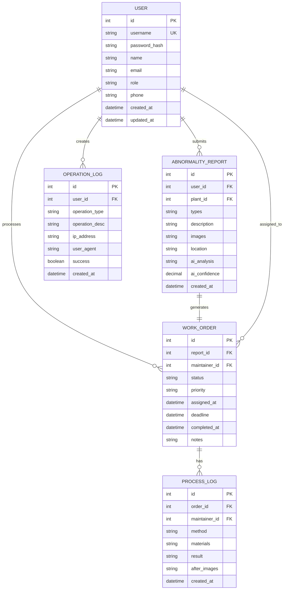

## 1. 架构设计



## 2. 技术栈描述

- **前端**: React@18 + Tailwind CSS@3 + Vite
- **初始化工具**: vite-init
- **后端**: Spring Boot@2.7 + MyBatis-Plus
- **数据库**: Supabase (PostgreSQL)
- **实时通信**: WebSocket + STOMP协议
- **AI服务**: Dify API (https://api.dify.ai/v1)
- **文件存储**: Supabase Storage
- **权限管理**: Spring Security + JWT

## 3. 路由定义

| 路由 | 用途 |
|-------|---------|
| / | 首页，异常上报入口 |
| /login | 登录页面，用户身份验证 |
| /dashboard | 管理员工作台，工单管理中心 |
| /maintainer | 养护员移动端界面 |
| /profile | 个人中心，历史记录查看 |
| /abnormality/:id | 异常详情页面 |
| /mobile/tasks | 移动端任务列表 |
| /mobile/task/:id | 移动端任务详情 |

## 4. API定义

### 4.1 用户认证相关
```
POST /api/auth/login
```

请求参数：
| 参数名 | 类型 | 必填 | 描述 |
|-----------|-------------|-------------|-------------|
| username | string | 是 | 用户名/学号 |
| password | string | 是 | 密码 |
| role | string | 是 | 用户角色(user/maintainer/admin) |

响应示例：
```json
{
  "token": "eyJhbGciOiJIUzI1NiIsInR5cCI6IkpXVCJ9...",
  "user": {
    "id": 1,
    "username": "student001",
    "role": "user",
    "name": "张三"
  }
}
```

### 4.2 异常上报相关
```
POST /api/abnormality/report
```

请求参数：
| 参数名 | 类型 | 必填 | 描述 |
|-----------|-------------|-------------|-------------|
| plantId | number | 是 | 植物ID |
| type | string[] | 是 | 异常类型数组 |
| description | string | 是 | 详细描述(≥20字) |
| images | File[] | 是 | 照片文件数组 |
| location | string | 否 | 位置描述 |

### 4.3 AI识别相关
```
POST /api/abnormality/analyze
```

请求参数：
| 参数名 | 类型 | 必填 | 描述 |
|-----------|-------------|-------------|-------------|
| image | File | 是 | 待分析图片 |

响应示例：
```json
{
  "confidence": 0.85,
  "predictedType": "病虫害",
  "suggestions": [
    "使用生物农药进行喷洒",
    "增加通风减少湿度",
    "修剪受害枝叶"
  ]
}
```

### 4.4 工单管理相关
```
GET /api/abnormality/tickets
```

查询参数：
| 参数名 | 类型 | 必填 | 描述 |
|-----------|-------------|-------------|-------------|
| status | string | 否 | 工单状态 |
| priority | string | 否 | 优先级 |
| area | string | 否 | 植物区域 |
| startDate | string | 否 | 开始时间 |
| endDate | string | 否 | 结束时间 |

```
POST /api/abnormality/assign
```

请求参数：
| 参数名 | 类型 | 必填 | 描述 |
|-----------|-------------|-------------|-------------|
| ticketId | number | 是 | 工单ID |
| maintainerId | number | 是 | 养护员ID |
| priority | string | 是 | 优先级设置 |
| notes | string | 否 | 分派备注 |

### 4.5 处理结果提交
```
POST /api/abnormality/process
```

请求参数：
| 参数名 | 类型 | 必填 | 描述 |
|-----------|-------------|-------------|-------------|
| ticketId | number | 是 | 工单ID |
| method | string | 是 | 处理方法 |
| materials | string[] | 是 | 使用材料 |
| result | string | 是 | 处理效果 |
| afterImages | File[] | 是 | 处理后照片 |

## 5. 服务器架构图



## 6. 数据模型

### 6.1 数据模型定义


### 6.2 数据定义语言

用户表 (users)
```sql
-- 创建用户表
CREATE TABLE users (
    id SERIAL PRIMARY KEY,
    username VARCHAR(50) UNIQUE NOT NULL,
    password_hash VARCHAR(255) NOT NULL,
    name VARCHAR(100) NOT NULL,
    email VARCHAR(100) UNIQUE,
    role VARCHAR(20) NOT NULL CHECK (role IN ('user', 'maintainer', 'admin')),
    phone VARCHAR(20),
    created_at TIMESTAMP DEFAULT CURRENT_TIMESTAMP,
    updated_at TIMESTAMP DEFAULT CURRENT_TIMESTAMP
);

-- 创建索引
CREATE INDEX idx_users_username ON users(username);
CREATE INDEX idx_users_role ON users(role);
```

异常报告表 (abnormality_reports)
```sql
-- 创建异常报告表
CREATE TABLE abnormality_reports (
    id SERIAL PRIMARY KEY,
    user_id INTEGER REFERENCES users(id),
    plant_id INTEGER,
    types VARCHAR(200) NOT NULL, -- JSON数组存储多个类型
    description TEXT NOT NULL CHECK (LENGTH(description) >= 20),
    images TEXT NOT NULL, -- JSON数组存储图片URL
    location VARCHAR(200),
    ai_analysis TEXT,
    ai_confidence DECIMAL(3,2),
    created_at TIMESTAMP DEFAULT CURRENT_TIMESTAMP
);

-- 创建索引
CREATE INDEX idx_reports_user_id ON abnormality_reports(user_id);
CREATE INDEX idx_reports_created_at ON abnormality_reports(created_at);
CREATE INDEX idx_reports_types ON abnormality_reports(types);
```

工单表 (work_orders)
```sql
-- 创建工单表
CREATE TABLE work_orders (
    id SERIAL PRIMARY KEY,
    report_id INTEGER UNIQUE REFERENCES abnormality_reports(id),
    maintainer_id INTEGER REFERENCES users(id),
    status VARCHAR(20) DEFAULT 'pending' CHECK (status IN ('pending', 'assigned', 'processing', 'completed', 'timeout')),
    priority VARCHAR(10) DEFAULT 'normal' CHECK (priority IN ('low', 'normal', 'high', 'urgent')),
    assigned_at TIMESTAMP,
    deadline TIMESTAMP,
    completed_at TIMESTAMP,
    notes TEXT,
    created_at TIMESTAMP DEFAULT CURRENT_TIMESTAMP,
    updated_at TIMESTAMP DEFAULT CURRENT_TIMESTAMP
);

-- 创建索引
CREATE INDEX idx_orders_status ON work_orders(status);
CREATE INDEX idx_orders_maintainer_id ON work_orders(maintainer_id);
CREATE INDEX idx_orders_deadline ON work_orders(deadline);
```

处理日志表 (process_logs)
```sql
-- 创建处理日志表
CREATE TABLE process_logs (
    id SERIAL PRIMARY KEY,
    order_id INTEGER REFERENCES work_orders(id),
    maintainer_id INTEGER REFERENCES users(id),
    method TEXT NOT NULL,
    materials TEXT NOT NULL, -- JSON数组存储材料列表
    result TEXT NOT NULL,
    after_images TEXT NOT NULL, -- JSON数组存储处理后图片URL
    created_at TIMESTAMP DEFAULT CURRENT_TIMESTAMP
);

-- 创建索引
CREATE INDEX idx_logs_order_id ON process_logs(order_id);
```

操作日志表 (operation_logs)
```sql
-- 创建操作日志表
CREATE TABLE operation_logs (
    id SERIAL PRIMARY KEY,
    user_id INTEGER REFERENCES users(id),
    operation_type VARCHAR(50) NOT NULL,
    operation_desc TEXT NOT NULL,
    ip_address VARCHAR(45),
    user_agent TEXT,
    success BOOLEAN DEFAULT true,
    created_at TIMESTAMP DEFAULT CURRENT_TIMESTAMP
);

-- 创建索引
CREATE INDEX idx_logs_user_id ON operation_logs(user_id);
CREATE INDEX idx_logs_created_at ON operation_logs(created_at);
CREATE INDEX idx_logs_operation_type ON operation_logs(operation_type);
```

### 6.3 权限配置
```sql
-- 为匿名用户授予基本读取权限
GRANT SELECT ON plants TO anon;
GRANT SELECT ON abnormality_reports TO anon;

-- 为认证用户授予完整权限
GRANT ALL PRIVILEGES ON abnormality_reports TO authenticated;
GRANT ALL PRIVILEGES ON work_orders TO authenticated;
GRANT ALL PRIVILEGES ON process_logs TO