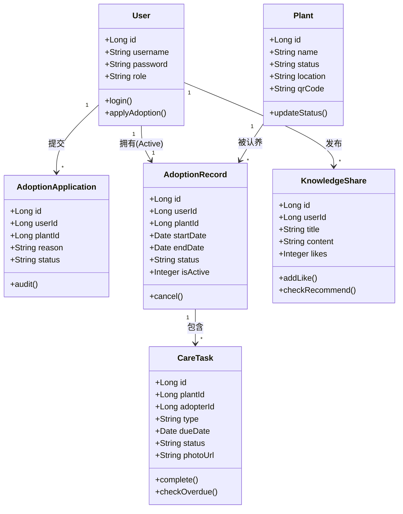
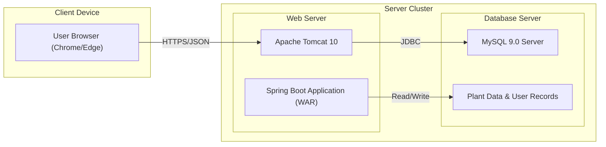

# 校园植物认养与养护系统 UML 建模图

## 1. 用例图 (Use Case Diagram)

### 描述

展示普通用户、后勤养护员、系统管理员与系统各功能模块的交互关系。

```mermaid
usecaseDiagram
    actor "普通用户" as User
    actor "后勤养护员" as Gardener
    actor "系统管理员" as Admin

    package "校园植物认养与养护系统" {
        usecase "注册登录" as UC1
        usecase "浏览植物信息" as UC2
        usecase "申请认养植物" as UC3
        usecase "执行养护任务" as UC4
        usecase "上报植物异常" as UC5
        usecase "发布知识分享" as UC6
        usecase "查看认养成果" as UC7

        usecase "审核认养申请" as UC8
        usecase "发布养护任务" as UC9
        usecase "管理用户信息" as UC10
        usecase "评选优秀养护人" as UC11

        usecase "维护植物信息" as UC12
        usecase "处理植物异常" as UC13
    }

    User --> UC1
    User --> UC2
    User --> UC3
    User --> UC4
    User --> UC5
    User --> UC6
    User --> UC7

    Admin --> UC1
    Admin --> UC8
    Admin --> UC9
    Admin --> UC10
    Admin --> UC11

    Gardener --> UC1
    Gardener --> UC12
    Gardener --> UC13
    Gardener --> UC9
```

## 2. 活动图 (Activity Diagrams)

### 2.1 认养申请流程 (Adoption Application)

**业务规则**：每人限领一株。

```mermaid
activityDiagram
    start
    :用户浏览植物列表;
    :选择心仪植物点击"申请认养";
    if (当前是否存在"生效中"的认养记录?) then (是)
        :系统提示"每人限领一株";
        stop
    else (否)
        :填写申请理由与养护经验;
        :提交申请单;
        :管理员收到待办通知;
        if (管理员审核通过?) then (是)
            :更新申请单状态为APPROVED;
            :更新植物状态为"已认养";
            :生成认养记录(Status=ACTIVE);
            :发送成功通知;
        else (否)
            :更新申请单状态为REJECTED;
            :发送驳回通知;
        endif
    endif
    stop
```

### 2.2 养护任务执行流程 (Task Execution)

**业务规则**：任务超时3天自动取消认养资格。

```mermaid
activityDiagram
    start
    :系统/管理员发布养护任务;
    fork
        :用户接收任务通知;
        :线下执行养护(浇水/除草);
        :上传执行照片打卡;
        if (系统自动审核通过?) then (是)
            :更新任务状态为COMPLETED;
            :增加用户积分;
        else (否)
            :转人工审核;
        endif
    fork again
        :系统定时扫描任务状态;
        if (当前时间 > 截止日期 + 3天 且 状态==PENDING?) then (是)
            :标记任务为OVERDUE;
            :触发"取消认养资格"流程;
            :更新认养记录为CANCELLED;
            :更新植物状态为"待认养";
            :发送惩罚通知;
        else (否)
            :继续等待;
        endif
    end fork
    stop
```

### 2.3 异常上报处理流程 (Exception Reporting)

**业务规则**：48小时未处理二次提醒。

```mermaid
activityDiagram
    start
    :用户发现植物异常(枯黄/虫害);
    :拍照并上传异常描述;
    :生成异常工单(Status=OPEN);
    :通知后勤养护员;
    fork
        :后勤员查看工单;
        :前往现场处理;
        :反馈处理结果;
        :更新工单状态为RESOLVED;
    fork again
        :系统定时监控工单时效;
        if (提交时间 > 48小时 且 状态==OPEN?) then (是)
            :触发超时告警;
            :向系统管理员发送"二次提醒";
            :管理员介入督办;
        else (否)
            :继续等待;
        endif
    end fork
    stop
```

### 2.4 成果评比流程 (Achievement Evaluation)

**业务规则**：任务完成率100%方可参选。

```mermaid
activityDiagram
    start
    :学期结束触发评比流程;
    :系统获取所有认养记录;
    :遍历每位用户的养护任务数据;
    if (任务完成率 == 100%?) then (是)
        :自动加入"优秀养护人"候选池;
        :计算植物健康度评分;
        :综合得分排名;
        :生成电子荣誉证书;
        :公示评比结果;
    else (否)
        :标记为"不具备参选资格";
    endif
    stop
```

## 3. 类图 (Class Diagram)

展示系统核心实体及其关系。



## 4. 系统架构图 (System Architecture)

前后端分离架构。

```mermaid
graph TD
    subgraph Client Layer
        Browser[Web Browser (Vue3)]
        Mobile[Mobile App (Uniapp/H5)]
    end

    subgraph Gateway Layer
        Nginx[Nginx Reverse Proxy]
    end

    subgraph Application Layer
        SpringBoot[Spring Boot 3.x Backend]
        Auth[Authentication Service (JWT)]
        Business[Business Logic Modules]
        Schedule[Scheduled Tasks (Quartz)]
    end

    subgraph Data Layer
        MySQL[MySQL 9.0 Database]
        Redis[Redis Cache]
        OSS[Object Storage Service (Images)]
    end

    Browser --> Nginx
    Mobile --> Nginx
    Nginx --> SpringBoot
    SpringBoot --> Auth
    SpringBoot --> Business
    SpringBoot --> Schedule
    Business --> MySQL
    Business --> Redis
    Business --> OSS
```

## 5. 部署图 (Deployment Diagram)

符合 Tomcat 10 + MySQL 9 要求。


