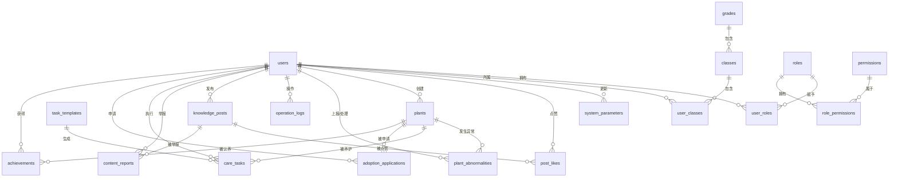

# 数据库设计文档

## 1. 实体关系图 (ER图)

*(请使用 Mermaid 或其他工具查看)*

## 2. 数据字典

### 2.1 用户表 (users)
| 字段名 | 类型 | 必填 | 默认值 | 描述 |
| :--- | :--- | :--- | :--- | :--- |
| id | bigint | 是 | AUTO_INCREMENT | 主键 |
| username | varchar(50) | 是 | | 用户名，唯一 |
| password | varchar(255) | 是 | | 密码（加密） |
| real_name | varchar(100) | 是 | | 真实姓名 |
| student_id | varchar(50) | 否 | | 学号/工号 |
| phone | varchar(20) | 否 | | 手机号 |
| email | varchar(100) | 否 | | 邮箱 |
| status | tinyint | 否 | 1 | 1-启用, 0-禁用 |
| avatar_url | varchar(500) | 否 | | 头像URL |
| token | varchar(255) | 否 | | 用户Token |
| token_expire_time | timestamp | 否 | | Token过期时间 |
| created_at | timestamp | 否 | NOW | 创建时间 |
| updated_at | timestamp | 否 | NOW | 更新时间 |
| deleted_at | timestamp | 否 | | 删除时间 |

### 2.2 植物表 (plants)
| 字段名 | 类型 | 必填 | 默认值 | 描述 |
| :--- | :--- | :--- | :--- | :--- |
| id | bigint | 是 | AUTO_INCREMENT | 主键 |
| plant_code | varchar(50) | 是 | | 植物编号，唯一 |
| name | varchar(100) | 是 | | 名称 |
| species | varchar(100) | 是 | | 品种 |
| family | varchar(100) | 否 | | 科属 |
| location_description | text | 是 | | 位置描述 |
| region | varchar(100) | 否 | | 区域 |
| care_difficulty | tinyint | 是 | 1 | 养护难度(1-5) |
| status | enum | 是 | AVAILABLE | AVAILABLE/ADOPTED |
| planting_year | year | 否 | | 种植年份 |
| light_requirement | varchar(50) | 否 | | 光照需求 |
| water_requirement | varchar(50) | 否 | | 水分需求 |
| description | text | 否 | | 详细描述 |
| image_urls | json | 否 | | 图片URL数组 |
| created_by | bigint | 是 | | 创建人ID |
| number | bigint | 是 | 0 | 数量 |

### 2.3 认养申请表 (adoption_applications)
| 字段名 | 类型 | 必填 | 默认值 | 描述 |
| :--- | :--- | :--- | :--- | :--- |
| id | bigint | 是 | AUTO_INCREMENT | 主键 |
| user_id | bigint | 是 | | 申请人ID |
| plant_id | bigint | 是 | | 植物ID |
| adoption_period_months | int | 是 | 6 | 认养周期(月) |
| care_experience | text | 否 | | 养护经验 |
| status | enum | 是 | PENDING | PENDING/APPROVED/REJECTED |
| rejection_reason | text | 否 | | 驳回原因 |
| approved_by | bigint | 否 | | 审核人ID |
| approved_at | timestamp | 否 | | 审核时间 |

### 2.4 养护任务表 (care_tasks)
| 字段名 | 类型 | 必填 | 默认值 | 描述 |
| :--- | :--- | :--- | :--- | :--- |
| id | bigint | 是 | AUTO_INCREMENT | 主键 |
| plant_id | bigint | 是 | | 植物ID |
| adopter_id | bigint | 是 | | 执行人ID |
| task_template_id | bigint | 否 | | 模板ID |
| task_type | varchar(50) | 是 | | 任务类型 |
| task_description | text | 是 | | 描述 |
| due_date | date | 是 | | 截止日期 |
| completed_date | date | 否 | | 完成日期 |
| status | enum | 是 | PENDING | PENDING/COMPLETED/OVERDUE |

### 2.5 认养成果表 (achievements)
| 字段名 | 类型 | 必填 | 默认值 | 描述 |
| :--- | :--- | :--- | :--- | :--- |
| id | bigint | 是 | AUTO_INCREMENT | 主键 |
| user_id | bigint | 是 | | 用户ID |
| plant_id | bigint | 是 | | 植物ID |
| semester | varchar(20) | 是 | | 学期 |
| total_tasks | int | 否 | 0 | 总任务数 |
| tasks_completed | int | 否 | 0 | 完成数 |
| task_completion_rate | decimal(5,2) | 否 | 0.00 | 完成率 |
| is_outstanding | tinyint | 否 | 0 | 是否优秀 |
| certificate_url | varchar(500) | 否 | | 证书URL |

### 2.6 知识分享表 (knowledge_posts)
| 字段名 | 类型 | 必填 | 默认值 | 描述 |
| :--- | :--- | :--- | :--- | :--- |
| id | bigint | 是 | AUTO_INCREMENT | 主键 |
| author_id | bigint | 是 | | 作者ID |
| title | varchar(200) | 是 | | 标题 |
| content | text | 是 | | 内容 |
| tag | varchar(50) | 是 | | 标签 |
| is_featured | tinyint | 否 | 0 | 是否推荐 |
| like_count | int | 否 | 0 | 点赞数 |
| status | enum | 是 | ACTIVE | ACTIVE/REPORTED/DELETED |

### 2.7 植物异常表 (plant_abnormalities)
| 字段名 | 类型 | 必填 | 默认值 | 描述 |
| :--- | :--- | :--- | :--- | :--- |
| id | bigint | 是 | AUTO_INCREMENT | 主键 |
| plant_id | bigint | 是 | | 植物ID |
| reporter_id | bigint | 是 | | 上报人ID |
| abnormality_type | enum | 是 | | 异常类型 |
| description | text | 是 | | 描述 |
| image_urls | json | 否 | | 图片 |
| status | enum | 是 | REPORTED | REPORTED/ASSIGNED/RESOLVED/ESCALATED |
| maintainer_id | bigint | 否 | | 处理人ID |

## 3. 索引优化建议

1.  **users**: `username` 已有唯一索引，查询性能良好。`status` 有索引，适合筛选。
2.  **plants**: `plant_code` 唯一索引。`status`, `region`, `care_difficulty` 均有索引，适合多维度筛选。建议增加复合索引 `idx_status_region` 优化组合查询。
3.  **care_tasks**: `status`, `due_date`, `plant_id`, `adopter_id` 均有索引。建议增加 `idx_adopter_status_due` 复合索引，优化“查询某人未完成的即将过期任务”。
4.  **adoption_applications**: `user_id`, `status` 均有索引。
5.  **knowledge_posts**: `tag`, `is_featured` 有索引。建议增加 `idx_created_at` 优化按时间排序的分页查询。

## 4. 关联关系分析

*   **1:N**: User -> AdoptionApplication, Plant -> AdoptionApplication
*   **1:N**: User -> CareTask, Plant -> CareTask
*   **1:N**: User -> KnowledgePost
*   **N:M**: User <-> Role (通过 user_roles)
*   **N:M**: Role <-> Permission (通过 role_permissions)
*   **N:M**: User <-> Class (通过 user_classes)

## 5. 性能优化

*   **级联删除**: 外键约束中配置了 `ON DELETE CASCADE`，如删除用户会级联删除其申请记录、任务记录等，需谨慎操作，建议逻辑删除。
*   **JSON字段**: `plants.image_urls`, `plant_abnormalities.image_urls` 使用 JSON 类型，MySQL 5.7+ 支持，查询时需注意性能，尽量在应用层解析。
*   **枚举类型**: `status` 字段大量使用 ENUM，节省空间但扩展性略差，建议在代码层维护枚举常量。
