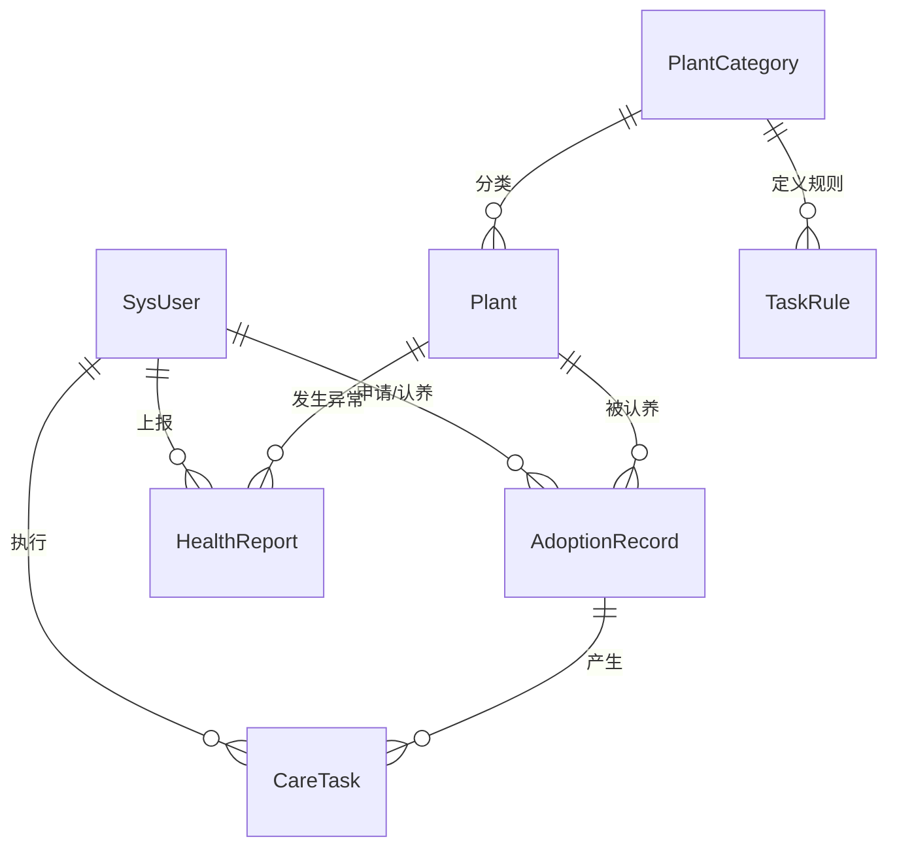

# 校园植物认养与养护系统系统设计说明书

## 1. 引言

### 1.1 编写目的

本文档旨在为“校园植物认养与养护系统”提供全面的技术架构与详细设计方案。基于需求分析结果，明确系统的技术栈选型、数据库结构、API接口规范及核心业务逻辑实现策略，指导后续的编码开发与测试工作。本文档符合本科软件工程毕业设计规范。

### 1.2 技术选型

- **开发语言**：Java (JDK 17)
- **后端框架**：Spring Boot 3.x + MyBatis-Plus + Sa-Token (权限) + Quartz (定时任务)
- **前端框架**：Vue 3 + Ant Design Vue + Echarts (图表)
- **数据库**：MySQL 9.0
- **缓存/中间件**：Redis 7.x (缓存/会话), WebSocket (实时推送)
- **部署容器**：Apache Tomcat 10

## 2. 系统架构设计

### 2.1 总体架构 (B/S 三层架构)

系统采用经典的前后端分离架构，分为表现层、业务逻辑层和数据访问层。

1.  **表现层 (Frontend)**
    - 基于 **Vue 3** 构建 SPA (单页应用)。
    - 使用 **Ant Design Vue** 组件库实现响应式布局。
    - 集成 **Echarts** 实现植物生长数据与养护成果的可视化展示。
    - 通过 **Axios** 拦截器统一处理请求/响应与 Token 注入。

2.  **业务逻辑层 (Backend)**
    - **Controller 层**：RESTful 接口定义，参数校验 (JSR-303)。
    - **Service 层**：核心业务逻辑，事务控制 (`@Transactional`)。
    - **Component 层**：
      - **Sa-Token**：实现登录认证、角色鉴权、踢人下线。
      - **Quartz**：动态任务调度（如每日生成养护任务、超时扫描）。
      - **WebSocket Server**：实现异常上报的实时推送与任务提醒。

3.  **数据访问层 (DAO)**
    - **MyBatis-Plus**：提供 BaseMapper，简化 CRUD 操作。
    - **Redis**：缓存热点数据（如植物详情、首页轮播、Token），减轻 DB 压力。
    - **MySQL**：存储持久化业务数据。

### 2.2 前后端交互模型

- **协议**：HTTP/1.1 & HTTP/2 (HTTPS)
- **数据格式**：JSON
- **鉴权方式**：Header 中携带 `satoken`，后端通过拦截器验证。
- **统一响应结构**：
  ```json
  {
    "code": 200, // 200成功, 500系统异常, 401未登录, 403无权限
    "msg": "操作成功",
    "data": { ... }
  }
  ```

## 3. 数据库设计

### 3.1 概念模型设计 (ER图描述)

- **用户 (SysUser)**：与 **角色** 多对多，与 **认养记录** 一对多。
- **植物 (Plant)**：与 **分类** 多对一，与 **认养记录** 一对多（历史记录）。
- **认养记录 (AdoptionRecord)**：连接用户与植物，包含 **养护任务**（一对多）。
- **养护任务 (CareTask)**：关联 **任务规则**。
- **异常上报 (HealthReport)**：关联用户与植物。



### 3.2 逻辑结构设计 (核心表结构)

#### 1. 系统日志表 (`sys_log`) - _新增_

| 字段名      | 类型        | 说明                      |
| :---------- | :---------- | :------------------------ |
| id          | BIGINT      | 主键                      |
| user_id     | BIGINT      | 操作人ID                  |
| module      | VARCHAR(50) | 模块名称                  |
| operation   | VARCHAR(50) | 操作类型 (新增/修改/导出) |
| ip_addr     | VARCHAR(50) | IP地址                    |
| create_time | DATETIME    | 操作时间                  |

#### 2. 植物分类与规则表 (`plant_categories` & `task_rules`) - _核心业务支撑_

_用于支持“基于品种与生长周期的任务推送”。_

**`plant_categories` (植物分类)**

- `id`: BIGINT
- `name`: VARCHAR(50) (如：多肉植物、乔木、草本)

**`task_rules` (养护规则)**

- `id`: BIGINT
- `category_id`: BIGINT (关联分类)
- `season`: TINYINT (1-春, 2-夏, 3-秋, 4-冬, 0-全季)
- `growth_stage`: TINYINT (1-幼苗, 2-成长期, 3-花期, 4-休眠期)
- `task_type`: VARCHAR(50) (浇水/施肥/修剪)
- `frequency_days`: INT (频率：每X天一次)
- `description`: VARCHAR(255) (任务指导文案)

#### 3. 异常上报表 (`plant_health_reports`) - _闭环设计_

| 字段名      | 类型     | 约束      | 说明                                                  |
| :---------- | :------- | :-------- | :---------------------------------------------------- |
| id          | BIGINT   | PK        | 主键                                                  |
| plant_id    | BIGINT   | FK        | 植物ID                                                |
| reporter_id | BIGINT   | FK        | 上报人ID                                              |
| description | TEXT     |           | 异常描述                                              |
| image_urls  | JSON     |           | 现场照片                                              |
| ai_analysis | TEXT     |           | **AI 预识别结果** (置信度/建议)                       |
| status      | ENUM     |           | PENDING(待处理), PROCESSING(处理中), RESOLVED(已解决) |
| handler_id  | BIGINT   | FK        | 处理人(后勤)ID                                        |
| created_at  | DATETIME |           | 上报时间                                              |
| handled_at  | DATETIME |           | 处理时间                                              |
| is_reminded | TINYINT  | Default 0 | **是否已触发二次提醒**                                |

_(其余 `sys_users`, `plants`, `adoption_records`, `care_tasks`, `achievements`, `knowledge_shares` 沿用需求分析阶段设计，并做字段优化)_

## 4. 接口设计

### 4.1 接口权限规范

- **匿名接口**：`/api/auth/login`, `/api/public/**`
- **普通用户**：`/api/user/**`, `/api/adoption/apply`, `/api/task/execute`
- **后勤人员**：`/api/gardener/**`, `/api/health/handle`
- **管理员**：`/api/admin/**`

### 4.2 核心接口定义

#### 4.2.1 养护任务管理

- **查询我的任务**
  - `GET /api/task/my-tasks`
  - Params: `date` (可选, YYYY-MM-DD), `status` (PENDING/COMPLETED)
- **执行打卡**
  - `POST /api/task/execute`
  - Body: `{ "taskId": 1001, "imageUrl": "http://...", "remarks": "已完成浇水" }`

#### 4.2.2 异常上报 (闭环)

- **提交上报 (含AI辅助)**
  - `POST /api/health/report`
  - Body: `{ "plantId": 200, "desc": "叶片发黄", "images": [...] }`
  - Response: `{ "reportId": 55, "aiSuggestion": "疑似缺氮，建议施肥" }`
- **处理异常 (后勤)**
  - `POST /api/health/resolve`
  - Body: `{ "reportId": 55, "result": "已喷洒药剂", "status": "RESOLVED" }`

#### 4.2.3 成果统计 (数据可视化)

- **获取个人养护雷达图数据**
  - `GET /api/stats/user/radar/{userId}`
  - Response: `{ "dimensions": ["勤奋度", "健康度", "互动值", "任务率"], "values": [85, 90, 60, 95] }`

## 5. 核心业务逻辑详细设计

### 5.1 智能任务推送引擎 (Quartz + Rules)

**逻辑描述**：

1.  **规则库构建**：管理员在 `task_rules` 表预设规则。例如：{"多肉", "夏季", "休眠期", "浇水", "15天/次"}。
2.  **每日生成 Job** (Cron: `0 0 4 * * ?` 凌晨4点)：
    - 遍历所有状态为 `ACTIVE` 的认养记录。
    - 获取当前植物的 `category`、`current_season` (根据当前月份计算)、`growth_stage`。
    - 查询匹配的 `task_rules`。
    - 检查 `care_tasks` 表，判断上一次同类型任务的完成时间。
    - 若 `(今天 - 上次完成时间) >= frequency_days`，则插入一条新的 `PENDING` 任务。
3.  **动态推送策略**：
    - **离线**：生成任务时，写入消息队列/Redis 待推送列表。
    - **登录时**：用户调用 `/login` 接口成功后，后端检查 Redis 中的待办任务，通过 WebSocket 推送 "您今日有 2 项待办养护任务"。
    - **在线**：若用户在线，Socket 直接弹窗提醒。

### 5.2 异常上报闭环与超时熔断

**逻辑描述**：

1.  **上报阶段**：
    - 前端调用图像识别 API (如百度 AI 接口) 初步识别病害。
    - 后端保存 Report，状态置为 `PENDING`。
    - **WebSocket 推送**：向所有在线的“后勤”角色用户广播新工单消息。
2.  **处理阶段**：
    - 后勤人员“接单” -> 状态变更为 `PROCESSING`。
    - 填写处理结果 -> 状态变更为 `RESOLVED`。
    - 系统自动通知上报用户“您的反馈已处理”。
3.  **超时监控 (Quartz)**：
    - **每小时执行** Job：查询 `WHERE status = 'PENDING' AND created_at < NOW() - INTERVAL 48 HOUR AND is_reminded = 0`。
    - **二次提醒**：对查询到的记录，向“管理员”发送高优先级 WebSocket 警告或邮件，并将 `is_reminded` 置为 1。

## 6. 接口清单概览 (部分)

| 模块   | 接口路径            | 方法 | 描述           | 权限     |
| :----- | :------------------ | :--- | :------------- | :------- |
| Auth   | /api/auth/login     | POST | 登录获取Token  | 匿名     |
| Plant  | /api/plant/list     | GET  | 分页查询植物   | User     |
| Plant  | /api/plant/import   | POST | Excel批量导入  | Admin    |
| Task   | /api/task/today     | GET  | 获取今日任务   | User     |
| Health | /api/health/pending | GET  | 获取待处理异常 | Gardener |
| Stats  | /api/stats/rank     | GET  | 获取养护排行榜 | Public   |
